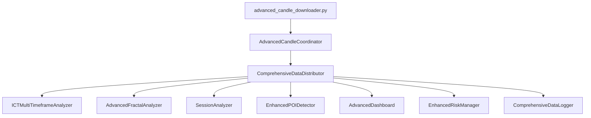

# 🏗️ ARQUITECTURA DEL SISTEMA ICT ENGINE v5.0 - INTEGRACIÓN COMPLETA
**Fecha:** 3 de Agosto 2025  
**Versión:** 5.0  
**Tipo:** Arquitectura Técnica Detallada  

---

## 🎯 VISIÓN ARQUITECTÓNICA

### **Transformación del Ecosistema**


---

## 📦 COMPONENTES PRINCIPALES

### **1. AdvancedCandleCoordinator (Sistema Central)**
```python
# Ubicación: sistema/candle_coordinator.py
class AdvancedCandleCoordinator:
    """
    RESPONSABILIDAD: Orquestación central de todo el ecosistema
    
    FUNCIONES CLAVE:
    - Conexión con advanced_candle_downloader.py
    - Gestión de suscriptores por categoría
    - Buffer inteligente multi-timeframe
    - Distribución de datos enriquecidos
    - Manejo de errores y recuperación
    """
    
    # ESTRUCTURA DE DATOS
    self.subscribers = {
        'dashboard': [],           # Callbacks del dashboard
        'poi_system': [],         # Sistema POI existente
        'ict_analyzer': [],       # Nuevo analizador ICT
        'fractal_detector': [],   # Detector de fractales
        'data_logger': [],        # Logging enriquecido
        'risk_manager': [],       # Gestión de riesgo
        'session_analyzer': [],   # Análisis de sesiones
        'alert_system': []        # Sistema de alertas
    }
    
    # TIMEFRAMES ACTIVOS
    self.active_timeframes = ["M1", "M5", "M15", "H1", "H4", "D1"]
    
    # SÍMBOLOS MONITOREADOS
    self.active_symbols = ["EURUSD", "GBPUSD", "USDJPY"]
```

### **2. ICTMultiTimeframeAnalyzer (Análisis ICT)**
```python
# Ubicación: core/ict_engine/ict_multi_timeframe_analyzer.py
class ICTMultiTimeframeAnalyzer:
    """
    RESPONSABILIDAD: Análisis completo de metodología ICT
    
    ALGORITMOS IMPLEMENTADOS:
    - Market Structure Analysis (BOS/CHOCH)
    - Fair Value Gap Detection (3-candle pattern)
    - Order Block Identification (institutional zones)
    - Liquidity Mapping (equal highs/lows)
    - Candle Range Theory (H4/D1 analysis)
    - Session-based Bias Analysis
    """
    
    # JERARQUÍA DE TIMEFRAMES
    self.timeframe_hierarchy = ["D1", "H4", "H1", "M15", "M5", "M1"]
    
    # PERFILES DE SESIÓN
    self.session_profiles = {
        'LONDON': {
            'characteristics': 'MANIPULATION_HEAVY',
            'typical_patterns': ['JUDAS_SWING', 'FVG', 'LIQUIDITY_GRABS']
        },
        'NEW_YORK': {
            'characteristics': 'DISTRIBUTION_FOCUSED', 
            'typical_patterns': ['SILVER_BULLET', 'ORDER_BLOCKS', 'POWER_OF_THREE']
        },
        'ASIAN': {
            'characteristics': 'ACCUMULATION_PHASE',
            'typical_patterns': ['CONSOLIDATION', 'MINOR_REVERSALS']
        }
    }
```

### **3. AdvancedFractalAnalyzer (Análisis Fractal)**
```python
# Ubicación: core/fractal_engine/fractal_analyzer.py
class AdvancedFractalAnalyzer:
    """
    RESPONSABILIDAD: Análisis completo de fractales Williams + ZigZag
    
    ALGORITMOS IMPLEMENTADOS:
    - Williams Fractals (5-candle pattern)
    - ZigZag Filtering (noise reduction)
    - Multi-timeframe Alignment
    - Fractal Strength Calculation
    - Trading Signal Generation
    - ICT Level Confluence
    """
    
    # UMBRALES DE FUERZA POR TIMEFRAME
    self.fractal_strength_thresholds = {
        'M1': 5, 'M5': 8, 'M15': 12, 
        'H1': 15, 'H4': 20, 'D1': 25
    }
    
    # CONFIGURACIÓN ZIGZAG
    self.zigzag_config = {
        'min_change_percentage': 0.5,
        'noise_reduction': True,
        'adaptive_threshold': True
    }
```

### **4. SessionAnalyzer (Análisis Temporal)**
```python
# Ubicación: core/session_engine/session_analyzer.py
class SessionAnalyzer:
    """
    RESPONSABILIDAD: Análisis de comportamiento por sesiones y Kill Zones
    
    PATRONES ICT IMPLEMENTADOS:
    - Power of Three (Accumulation → Manipulation → Distribution)
    - Silver Bullet (10:00-11:00 GMT setup)
    - Kill Zones (London Open, NY Open, etc.)
    - Session Characterization
    - Volatility Forecasting
    """
    
    # KILL ZONES ICT
    self.kill_zones = {
        'LONDON_OPEN': {'time': '08:00-09:00', 'priority': 'HIGH'},
        'NY_OPEN': {'time': '13:30-14:30', 'priority': 'VERY_HIGH'},
        'SILVER_BULLET': {'time': '10:00-11:00', 'priority': 'HIGH'},
        'POWER_OF_THREE': {'time': '13:30-15:00', 'priority': 'HIGH'}
    }
```

---

## 🔄 FLUJO DE DATOS COMPLETO

### **Arquitectura de Procesamiento en Tiempo Real**
```
1. DESCARGA DE VELAS
   advanced_candle_downloader.py
   ↓ (cada 5 segundos para M1)
   
2. COORDINACIÓN CENTRAL
   AdvancedCandleCoordinator
   ↓ (distribución asíncrona)
   
3. ANÁLISIS PARALELO
   ├── ICTMultiTimeframeAnalyzer
   ├── AdvancedFractalAnalyzer  
   ├── SessionAnalyzer
   └── EnhancedPOIDetector
   ↓ (síntesis de resultados)
   
4. DISTRIBUCIÓN ENRIQUECIDA
   ├── AdvancedDashboard (visualización)
   ├── EnhancedDataLogger (persistencia)
   ├── AlertSystem (notificaciones)
   └── RiskManager (gestión)
```

### **Estructura de Datos Enriquecidos**
```python
enriched_candle_data = {
    'raw_candles': pd.DataFrame,           # Velas originales
    'timeframe': str,                      # M1, M5, M15, etc.
    'timestamp': datetime,                 # Momento del análisis
    
    'ict_analysis': {
        'market_structure': {
            'break_of_structure': bool,
            'market_direction': str,
            'structure_strength': float,
            'confluence_rating': int
        },
        'fair_value_gaps': [
            {
                'type': 'BULLISH_FVG' | 'BEARISH_FVG',
                'gap_size_pips': float,
                'probability_fill': float,
                'session_context': str
            }
        ],
        'order_blocks': [
            {
                'type': 'BULLISH_OB' | 'BEARISH_OB',
                'institutional_footprint': str,
                'confirmation_strength': float,
                'expected_reaction': str
            }
        ],
        'session_context': {
            'current_session': str,
            'kill_zone_active': bool,
            'institutional_activity': str,
            'volatility_forecast': str
        }
    },
    
    'fractal_signals': {
        'bullish_fractals': [
            {
                'price': float,
                'strength': int,
                'confluence_score': int,
                'probability_score': float,
                'ict_alignment': bool
            }
        ],
        'bearish_fractals': [...],
        'trading_signals': [
            {
                'signal_type': 'FRACTAL_REVERSAL',
                'direction': 'BUY' | 'SELL',
                'confidence_score': float,
                'risk_reward_ratio': float
            }
        ]
    },
    
    'session_analysis': {
        'power_of_three': {
            'pattern_completion': bool,
            'pattern_strength': int,
            'expected_target': float
        },
        'silver_bullet': {
            'setup_detected': bool,
            'direction': str,
            'probability_success': float
        }
    },
    
    'market_synthesis': {
        'overall_bias': str,
        'confluence_score': int,           # 0-10
        'trade_opportunities': [],
        'market_narrative': str,
        'optimal_strategy': str
    }
}
```

---

## ⚡ CONFIGURACIÓN DE TIEMPO REAL

### **Intervalos de Actualización por Timeframe**
```python
UPDATE_INTERVALS = {
    'M1': 5,     # Cada 5 segundos (crítico)
    'M5': 30,    # Cada 30 segundos (importante) 
    'M15': 60,   # Cada minuto (moderado)
    'H1': 300,   # Cada 5 minutos (relajado)
    'H4': 900,   # Cada 15 minutos (esporádico)
    'D1': 3600   # Cada hora (histórico)
}
```

### **Arquitectura de Bucles Asíncronos**
```python
class ComprehensiveRealTimeEngine:
    async def start_comprehensive_system(self):
        # Crear tareas paralelas por timeframe
        tasks = []
        for timeframe, interval in UPDATE_INTERVALS.items():
            task = asyncio.create_task(
                self.timeframe_loop(timeframe, interval)
            )
            tasks.append(task)
            
        # Tareas de sistema
        tasks.extend([
            asyncio.create_task(self.system_monitor_loop()),
            asyncio.create_task(self.alert_generation_loop()),
            asyncio.create_task(self.performance_tracking_loop())
        ])
        
        # Ejecutar todo concurrentemente
        await asyncio.gather(*tasks)
```

---

## 📊 MÉTRICAS DE RENDIMIENTO

### **Objetivos de Performance**
```python
PERFORMANCE_TARGETS = {
    'processing_time_per_analysis': '< 500ms',
    'memory_usage_max': '< 512MB',
    'cpu_usage_avg': '< 25%',
    'concurrent_timeframes': 6,
    'uptime_target': '99.9%',
    'data_latency': '< 100ms',
    'alert_generation_time': '< 50ms'
}
```

### **Sistema de Monitoreo**
```python
class PerformanceMonitor:
    def __init__(self):
        self.metrics = {
            'candles_processed': 0,
            'analyses_completed': 0,
            'alerts_generated': 0,
            'errors_count': 0,
            'average_processing_time': 0,
            'memory_usage_mb': 0,
            'cpu_usage_percent': 0
        }
```

---

## 🛡️ GESTIÓN DE ERRORES Y RECUPERACIÓN

### **Estrategia de Resilencia**
```python
ERROR_HANDLING_STRATEGY = {
    'connection_errors': {
        'retry_attempts': 3,
        'backoff_strategy': 'exponential',
        'fallback_action': 'use_cached_data'
    },
    'data_corruption': {
        'validation_checks': True,
        'auto_correction': True,
        'quarantine_bad_data': True
    },
    'memory_overflow': {
        'automatic_cleanup': True,
        'buffer_size_limits': True,
        'garbage_collection': 'aggressive'
    },
    'analysis_failures': {
        'graceful_degradation': True,
        'partial_results': True,
        'error_notification': True
    }
}
```

---

## 🔧 CONFIGURACIÓN MODULAR

### **Archivo de Configuración Principal**
```python
# config/comprehensive_config.py
SYSTEM_CONFIG = {
    # Configuración de fuentes de datos
    "data_sources": {
        "primary": "advanced_candle_downloader",
        "backup": "mt5_direct",
        "symbols": ["EURUSD", "GBPUSD", "USDJPY"],
        "timeframes": ["M1", "M5", "M15", "H1", "H4", "D1"]
    },
    
    # Configuración ICT
    "ict_settings": {
        "fair_value_gaps": {
            "min_gap_size_pips": 5,
            "max_gap_age_hours": 24,
            "displacement_threshold": 0.8
        },
        "order_blocks": {
            "min_reaction_pips": 15,
            "volume_confirmation": True,
            "time_validity_hours": 48
        },
        "session_analysis": {
            "timezone": "GMT",
            "kill_zones": {
                "london_open": {"start": "08:00", "end": "09:00"},
                "ny_open": {"start": "13:30", "end": "14:30"}
            }
        }
    },
    
    # Configuración de fractales
    "fractal_settings": {
        "williams_fractals": {
            "confirmation_candles": 2,
            "min_strength_threshold": 5
        },
        "zigzag_filter": {
            "min_change_percentage": 0.5,
            "noise_reduction": True
        }
    },
    
    # Configuración de riesgo
    "risk_settings": {
        "base_risk_per_trade": 0.02,
        "max_risk_per_day": 0.06,
        "session_multipliers": {
            "ASIAN": 0.5,
            "LONDON": 1.0,
            "NEW_YORK": 1.2
        }
    }
}
```

---

## 📱 INTEGRACIÓN CON DASHBOARD

### **Arquitectura de UI Avanzada**
```python
class AdvancedICTDashboard:
    """
    PANELES ESPECIALIZADOS:
    
    1. Panel ICT Multi-Timeframe
       - Market Structure status
       - Fair Value Gaps activos
       - Order Blocks disponibles
       - Session context
    
    2. Panel de Fractales Avanzado
       - Fractales activos por timeframe
       - Señales de trading
       - Confluencia con ICT
    
    3. Panel de Análisis de Sesión
       - Sesión actual y progreso
       - Kill Zones activas
       - Patterns ICT detectados
    
    4. Panel de Síntesis del Mercado
       - Bias general del mercado
       - Confluencia total (0-10)
       - Narrativa inteligente
       - Estrategia óptima recomendada
    """
```

---

## 🚀 ESCALABILIDAD Y EXTENSIBILIDAD

### **Diseño para Crecimiento**
```python
SCALABILITY_FEATURES = {
    'horizontal_scaling': {
        'multiple_symbols': 'easy_addition',
        'new_timeframes': 'plug_and_play',
        'additional_markets': 'configuration_based'
    },
    'vertical_scaling': {
        'performance_optimization': 'continuous',
        'memory_management': 'intelligent',
        'cpu_utilization': 'efficient'
    },
    'extensibility': {
        'new_analysis_modules': 'modular_design',
        'custom_indicators': 'plugin_architecture',
        'external_integrations': 'api_ready'
    }
}
```

---

## 📋 CHECKLIST DE IMPLEMENTACIÓN

### **✅ Fase 1: Fundación (Días 1-14)**
- [ ] Auditar advanced_candle_downloader.py
- [ ] Implementar AdvancedCandleCoordinator
- [ ] Crear sistema de suscriptores
- [ ] Desarrollar ICTMultiTimeframeAnalyzer
- [ ] Implementar AdvancedFractalAnalyzer
- [ ] Crear SessionAnalyzer

### **⚡ Fase 2: Integración (Días 15-28)**
- [ ] Modificar dashboard_definitivo.py
- [ ] Implementar AdvancedDashboardController
- [ ] Integrar sistema POI existente
- [ ] Actualizar data_logger.py
- [ ] Crear enhanced_risk_manager

### **🚀 Fase 3: Tiempo Real (Días 29-42)**
- [ ] Implementar ComprehensiveRealTimeEngine
- [ ] Crear bucles por timeframe
- [ ] Sistema de alertas en tiempo real
- [ ] Optimización de rendimiento
- [ ] Tests de resistencia

### **📚 Fase 4: Finalización (Días 43-56)**
- [ ] Testing completo end-to-end
- [ ] Documentación de usuario
- [ ] Manual de troubleshooting
- [ ] Deployment en producción

---

**📅 Fecha de Implementación:** 3 de Agosto 2025  
**⚡ Arquitecto:** ICT Engine v5.0 Team  
**🎯 Estado:** READY FOR DEVELOPMENT**

---

**Sistema ICT Engine v5.0 - Arquitectura de Ecosistema Completo**  
*"Transformando datos en inteligencia institucional"*
