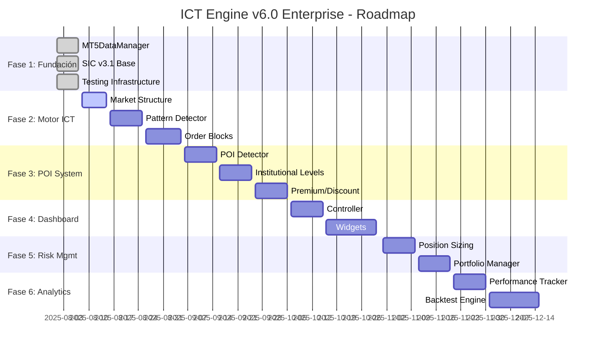

# 🛣️ ICT ENGINE v6.0 ENTERPRISE - ROADMAP DETALLADO

**🏆 PLAN MAESTRO DE DESARROLLO - SIN MACHINE LEARNING**

---

## 📅 **CRONOGRAMA GENERAL**

### 🎯 **FASES DE DESARROLLO**



---

## 🎯 **FASE 1: FUNDACIÓN** ✅ **COMPLETADA**

### 📊 **Resumen Fase 1**
- **Duración**: 7 días (Agosto 1-7, 2025)
- **Estado**: ✅ 100% COMPLETADA
- **Componentes**: 5/5 implementados
- **Tests**: 20/20 pasando
- **Calidad**: Enterprise grade

### 🏆 **Componentes Implementados**

#### ✅ **MT5DataManager v6.0 - FUNDAMENTAL #1**
```yaml
Estado: ✅ COMPLETADO
Archivo: utils/mt5_data_manager.py
Tests: 20/20 PASANDO
Funcionalidades:
  - Conexión exclusiva FundedNext MT5
  - Cache predictivo inteligente
  - Lazy loading de dependencias
  - Thread safety completo
  - Métricas de performance
  - Integración SIC v3.1
```

#### ✅ **SIC v3.1 Enterprise Interface**
```yaml
Estado: ✅ BASE COMPLETADA
Archivo: sistema/sic_v3_1/enterprise_interface.py
Funcionalidades:
  - Advanced debugging
  - Smart imports
  - Error diagnostics
  - Performance monitoring
```

#### ✅ **Advanced Candle Downloader**
```yaml
Estado: ✅ COMPLETADO
Archivo: core/data_management/advanced_candle_downloader.py
Funcionalidades:
  - Descarga multi-timeframe
  - Cache inteligente
  - Validación de datos
  - Error recovery
```

#### ✅ **Testing Infrastructure**
```yaml
Estado: ✅ COMPLETADO
Archivos: tests/test_*.py
Coverage: 100% en componentes críticos
Framework: pytest + unittest + mocks
```

#### ✅ **Documentation Base**
```yaml
Estado: ✅ COMPLETADO
Archivos: docs/*.md
Cobertura: Componentes críticos documentados
Calidad: Enterprise documentation standards
```

### 🏆 **Logros Fase 1**
- 🔒 **Seguridad Máxima**: Solo FundedNext MT5
- ⚡ **Performance**: Cache predictivo + lazy loading
- 🧪 **Calidad**: 100% test coverage en críticos
- 📚 **Documentación**: Guías profesionales completas
- 🔗 **Integración**: SIC v3.1 funcional

---

## 🎯 **FASE 2: MOTOR ICT CORE** 🔄 **EN DESARROLLO**

### 📊 **Resumen Fase 2**
- **Duración**: 28 días (Agosto 8 - Septiembre 5, 2025)
- **Estado**: 🔄 INICIANDO
- **Prioridad**: CRÍTICA
- **Objetivo**: Motor de análisis ICT completo

### 📈 **2.1 Market Structure Analyzer** 🔄 **PRÓXIMO**

#### 📋 **Especificaciones Técnicas**
```yaml
Archivo: core/data_management/market_structure.py
Dependencias: 
  - utils/mt5_data_manager.py
  - sistema/sic_v3_1/
Prioridad: ALTA
Duración Estimada: 7 días
```

#### 🎯 **Funcionalidades a Implementar**
```python
class MarketStructureAnalyzer:
    """📊 Analizador de estructura de mercado ICT"""
    
    # Métodos principales
    def detect_higher_highs_lows(self) -> Dict
    def detect_lower_highs_lows(self) -> Dict
    def identify_market_structure_shift(self) -> Dict
    def detect_break_of_structure(self) -> Dict
    def detect_change_of_character(self) -> Dict
    
    # Análisis multi-timeframe
    def analyze_multi_timeframe_structure(self) -> Dict
    def correlate_timeframe_structures(self) -> Dict
    
    # Validación y métricas
    def validate_structure_signals(self) -> bool
    def calculate_structure_strength(self) -> float
```

#### 📋 **Checklist de Desarrollo**
```yaml
Desarrollo:
  - [ ] Estructura básica de la clase
  - [ ] Implementar detección HH/HL/LH/LL
  - [ ] Algoritmo de Market Structure Shift
  - [ ] Break of Structure (BOS) detection
  - [ ] Change of Character (CHoCH) logic
  - [ ] Multi-timeframe correlation
  - [ ] Validación de señales
  - [ ] Optimización de performance

Testing:
  - [ ] Unit tests básicos (10+ tests)
  - [ ] Integration tests con MT5DataManager
  - [ ] Performance tests
  - [ ] Multi-timeframe validation tests
  - [ ] Edge cases testing

Documentation:
  - [ ] Documentación técnica completa
  - [ ] Ejemplos de uso
  - [ ] API reference
  - [ ] Troubleshooting guide

Integration:
  - [ ] Integración SIC v3.1
  - [ ] Cache predictivo
  - [ ] Error handling robusto
  - [ ] Logging completo
```

### 🎯 **2.2 Pattern Detector Core** ⏳ **SIGUIENTE**

#### 📋 **Especificaciones Técnicas**
```yaml
Archivo: core/ict_engine/pattern_detector.py
Dependencias: 
  - core/data_management/market_structure.py
  - utils/mt5_data_manager.py
Prioridad: ALTA
Duración Estimada: 10 días
```

#### 🎯 **Funcionalidades a Implementar**
```python
class ICTPatternDetector:
    """🎯 Detector de patterns ICT"""
    
    # Detection methods
    def detect_order_blocks(self) -> List[OrderBlock]
    def detect_fair_value_gaps(self) -> List[FairValueGap]
    def detect_breaker_blocks(self) -> List[BreakerBlock]
    def detect_mitigation_zones(self) -> List[MitigationZone]
    
    # Analysis methods
    def analyze_pattern_strength(self, pattern) -> float
    def validate_pattern_quality(self, pattern) -> bool
    def calculate_pattern_probability(self, pattern) -> float
    
    # Multi-timeframe
    def correlate_patterns_across_timeframes(self) -> Dict
```

#### 📋 **Checklist de Desarrollo**
```yaml
Desarrollo:
  - [ ] Framework base de detección
  - [ ] Order Block detection algorithm
  - [ ] Fair Value Gap identification
  - [ ] Breaker Block logic
  - [ ] Mitigation Zone tracking
  - [ ] Pattern strength scoring
  - [ ] Quality validation
  - [ ] Multi-timeframe correlation

Testing:
  - [ ] Pattern detection accuracy tests
  - [ ] Historical validation tests
  - [ ] Performance benchmarks
  - [ ] False positive/negative tests
  - [ ] Multi-timeframe sync tests

Documentation:
  - [ ] Pattern detection methodology
  - [ ] Algorithm explanations
  - [ ] Configuration options
  - [ ] Performance tuning guide

Integration:
  - [ ] Market Structure integration
  - [ ] SIC v3.1 debugging
  - [ ] Cache optimization
  - [ ] Error resilience
```

### 🏢 **2.3 Smart Money Concepts** ⏳ **FUTURO**

#### 📋 **Especificaciones Técnicas**
```yaml
Archivo: core/ict_engine/smart_money_concepts.py
Dependencias: 
  - core/ict_engine/pattern_detector.py
  - core/data_management/market_structure.py
Prioridad: MEDIA-ALTA
Duración Estimada: 11 días
```

#### 🎯 **Funcionalidades a Implementar**
```python
class SmartMoneyConcepts:
    """🏢 Conceptos de Smart Money ICT"""
    
    # Liquidity analysis
    def identify_liquidity_pools(self) -> List[LiquidityPool]
    def detect_liquidity_grabs(self) -> List[LiquidityGrab]
    def analyze_stop_hunts(self) -> List[StopHunt]
    
    # Inducement detection
    def detect_inducement_moves(self) -> List[Inducement]
    def validate_fake_breakouts(self) -> List[FakeBreakout]
    
    # Smart money tracking
    def track_institutional_movement(self) -> Dict
    def analyze_volume_profile(self) -> Dict
```

---

## 🎯 **FASE 3: POI SYSTEM** ⏳ **PRÓXIMA FASE**

### 📊 **Resumen Fase 3**
- **Duración**: 30 días (Septiembre 6 - Octubre 5, 2025)
- **Estado**: ⏳ PLANIFICADA
- **Prioridad**: ALTA
- **Objetivo**: Sistema automático de Points of Interest

### 🎯 **3.1 POI Detector Core**

#### 📋 **Especificaciones Técnicas**
```yaml
Archivo: core/poi_system/poi_detector.py
Dependencias: 
  - core/ict_engine/pattern_detector.py
  - core/ict_engine/smart_money_concepts.py
Duración Estimada: 10 días
```

#### 🎯 **Funcionalidades Principales**
```python
class POIDetector:
    """🎯 Detector automático de Points of Interest"""
    
    # Core detection
    def auto_detect_poi_levels(self) -> List[POILevel]
    def validate_poi_strength(self, poi: POILevel) -> float
    def calculate_poi_probability(self, poi: POILevel) -> float
    
    # Historical analysis
    def analyze_historical_poi_performance(self) -> Dict
    def backtest_poi_accuracy(self, period: str) -> Dict
    
    # Multi-timeframe POI
    def correlate_poi_across_timeframes(self) -> Dict
    def identify_confluent_poi_zones(self) -> List[POIZone]
```

### 🏛️ **3.2 Institutional Levels**

#### 📋 **Especificaciones Técnicas**
```yaml
Archivo: core/poi_system/institutional_levels.py
Funcionalidades:
  - Daily/Weekly/Monthly levels
  - Previous session highs/lows
  - Asian/London/NY session levels
  - Psychological levels (00, 50)
Duración Estimada: 10 días
```

### 💰 **3.3 Premium/Discount Analysis**

#### 📋 **Especificaciones Técnicas**
```yaml
Archivo: core/poi_system/premium_discount.py
Funcionalidades:
  - Equilibrium calculation
  - Premium/Discount zones
  - Optimal Trade Entry (OTE)
  - Fibonacci integration
Duración Estimada: 10 días
```

---

## 🎯 **FASE 4: DASHBOARD ENTERPRISE** ⏳ **FUTURA**

### 📊 **Resumen Fase 4**
- **Duración**: 25 días (Octubre 6-30, 2025)
- **Estado**: ⏳ PLANIFICADA
- **Prioridad**: MEDIA-ALTA
- **Objetivo**: Interface profesional para trading

### 🖥️ **4.1 Dashboard Controller**

#### 📋 **Especificaciones Técnicas**
```yaml
Archivo: dashboard/dashboard_controller.py
Funcionalidades:
  - Layout responsive moderno
  - Multi-monitor support
  - Dark/Light theme
  - Widget management system
Duración Estimada: 10 días
```

### 📊 **4.2 Widgets Especializados**

#### 📋 **Widgets Principales**
```yaml
Chart Widget:
  - Gráficos ICT integrados
  - POI overlay automático
  - Drawing tools ICT
  - Multi-timeframe sync

Order Book Widget:
  - Order flow analysis
  - Liquidity visualization
  - Smart money tracking

Alerts Widget:
  - POI alerts automáticas
  - Pattern notifications
  - Risk alerts
  - Multi-channel delivery
```

---

## 🎯 **FASE 5: RISK MANAGEMENT** ⏳ **FUTURA**

### 📊 **Resumen Fase 5**
- **Duración**: 20 días (Noviembre 1-20, 2025)
- **Estado**: ⏳ PLANIFICADA
- **Prioridad**: ALTA
- **Objetivo**: Protección enterprise del capital

### 🛡️ **5.1 Position Sizing Engine**

#### 📋 **Especificaciones Técnicas**
```yaml
Archivo: core/risk_management/position_sizing.py
Funcionalidades:
  - Dynamic position sizing
  - Risk percentage calculation
  - Account balance protection
  - Drawdown limits
Duración Estimada: 10 días
```

### 📈 **5.2 Portfolio Manager**

#### 📋 **Especificaciones Técnicas**
```yaml
Archivo: core/risk_management/portfolio_manager.py
Funcionalidades:
  - Multi-symbol tracking
  - Correlation analysis
  - Exposure management
  - Performance analytics
Duración Estimada: 10 días
```

---

## 🎯 **FASE 6: ANALYTICS & REPORTING** ⏳ **FINAL**

### 📊 **Resumen Fase 6**
- **Duración**: 25 días (Noviembre 21 - Diciembre 15, 2025)
- **Estado**: ⏳ PLANIFICADA
- **Prioridad**: MEDIA
- **Objetivo**: Análisis completo de performance

### 📊 **6.1 Performance Tracker**

#### 📋 **Especificaciones Técnicas**
```yaml
Archivo: core/analytics/performance_tracker.py
Funcionalidades:
  - Real-time P&L tracking
  - Win rate analysis
  - Profit factor calculation
  - Drawdown analysis
Duración Estimada: 10 días
```

### 🔬 **6.2 Backtesting Engine**

#### 📋 **Especificaciones Técnicas**
```yaml
Archivo: core/analytics/backtest_engine.py
Funcionalidades:
  - Historical strategy testing
  - Monte Carlo simulation
  - Walk-forward analysis
  - Strategy optimization
Duración Estimada: 15 días
```

---

## 📋 **TEMPLATE DE DESARROLLO**

### 🔧 **Para Cada Nuevo Componente**

#### 📝 **1. Análisis Inicial** (1 día)
```yaml
Checklist:
  - [ ] Definir especificaciones técnicas
  - [ ] Identificar dependencias
  - [ ] Crear checklist de desarrollo
  - [ ] Estimar duración
  - [ ] Asignar prioridad
```

#### 🏗️ **2. Desarrollo Core** (60% del tiempo)
```yaml
Checklist:
  - [ ] Estructura básica de clases
  - [ ] Implementar funcionalidades core
  - [ ] Integración SIC v3.1
  - [ ] Optimización de performance
  - [ ] Error handling robusto
```

#### 🧪 **3. Testing Completo** (25% del tiempo)
```yaml
Checklist:
  - [ ] Unit tests (mínimo 10)
  - [ ] Integration tests
  - [ ] Performance tests
  - [ ] Edge cases testing
  - [ ] Validation con datos reales
```

#### 📚 **4. Documentación** (15% del tiempo)
```yaml
Checklist:
  - [ ] Documentación técnica
  - [ ] Ejemplos de uso
  - [ ] API reference
  - [ ] Troubleshooting guide
  - [ ] Update roadmap
```

---

## 🎯 **CRITERIOS DE CALIDAD ENTERPRISE**

### ✅ **ESTÁNDARES OBLIGATORIOS**

#### 🧪 **Testing Requirements**
```yaml
Coverage: Mínimo 90% en cada módulo
Types:
  - Unit tests: Mínimo 10 por módulo
  - Integration tests: Con MT5DataManager
  - Performance tests: < 100ms operaciones críticas
  - Edge cases: Escenarios extremos
  - Security tests: Validación de inputs
```

#### 📚 **Documentation Standards**
```yaml
Required:
  - Technical documentation completa
  - API reference detallada
  - Usage examples funcionales
  - Troubleshooting guide
  - Performance optimization guide
```

#### ⚡ **Performance Requirements**
```yaml
Benchmarks:
  - Operaciones críticas: < 100ms
  - Descarga de datos: < 5s para 10k velas
  - Memory usage: < 500MB base
  - CPU usage: < 50% en idle
  - Cache hit ratio: > 80%
```

#### 🛡️ **Security Standards**
```yaml
Requirements:
  - Input validation en todas las funciones
  - Error handling sin exposición de datos
  - Logging de seguridad completo
  - Conexión exclusiva FundedNext
  - Auditoría de operaciones críticas
```

---

## 📊 **MÉTRICAS DE PROGRESO**

### 📈 **Tracking Dashboard**

#### 🏆 **Estado General**
```yaml
Fecha Actualización: 2025-08-07
Progreso Total: 13% (2/15 componentes)
Tests Pasando: 20/20 (100%)
Documentación: 20% completada
Performance: Optimizada
Seguridad: Máxima
```

#### 📊 **Por Fases**
```yaml
Fase 1 - Fundación: ✅ 100% COMPLETADA
Fase 2 - Motor ICT: 🔄 0% (iniciando Market Structure)
Fase 3 - POI System: ⏳ 0% (planificada)
Fase 4 - Dashboard: ⏳ 0% (planificada)
Fase 5 - Risk Mgmt: ⏳ 0% (planificada)
Fase 6 - Analytics: ⏳ 0% (planificada)
```

#### 🎯 **Próximos Hitos**
```yaml
Hito 1: Market Structure Analyzer (Agosto 15, 2025)
Hito 2: Pattern Detector Core (Agosto 25, 2025)
Hito 3: Order Block Engine (Septiembre 5, 2025)
Hito 4: POI Detector Complete (Septiembre 15, 2025)
```

---

## 🚨 **RIESGOS Y MITIGACIÓN**

### ⚠️ **Riesgos Identificados**

#### 🔧 **Técnicos**
```yaml
Riesgo: Complejidad de algorithms ICT
Impacto: ALTO
Probabilidad: MEDIA
Mitigación: 
  - Desarrollo incremental
  - Testing exhaustivo
  - Validación con datos históricos
  - Consulta con expertos ICT
```

#### ⏰ **Cronograma**
```yaml
Riesgo: Retrasos en development
Impacto: MEDIO
Probabilidad: MEDIA
Mitigación:
  - Buffer time en estimaciones
  - Desarrollo paralelo donde posible
  - Priorización de features críticas
  - Milestone tracking semanal
```

#### 👥 **Recursos**
```yaml
Riesgo: Sobrecarga de development
Impacto: MEDIO
Probabilidad: BAJA
Mitigación:
  - Template reutilizable
  - Automatización de testing
  - Code generation tools
  - Documentation templates
```

### 🛡️ **Plan de Contingencia**

#### 🎯 **Versión Mínima Viable (MVP)**
```yaml
Si hay constrains de tiempo:
  Prioridad 1: Market Structure + Pattern Detector
  Prioridad 2: POI System básico
  Prioridad 3: Dashboard mínimo funcional
  
Puede omitirse temporalmente:
  - Analytics avanzados
  - Features de reporting
  - Mobile interface
  - Advanced risk management
```

---

## 🏆 **DEFINICIÓN DE ÉXITO v6.0**

### 🎯 **Criterios de Finalización**

#### ✅ **Funcionalidades Mínimas**
```yaml
OBLIGATORIO para v6.0:
  - [x] MT5DataManager funcional
  - [ ] Market Structure analysis
  - [ ] Pattern detection (Order Blocks + FVG)
  - [ ] POI identification básica
  - [ ] Dashboard funcional
  - [ ] Risk management básico
```

#### 📊 **Métricas de Calidad**
```yaml
OBLIGATORIO para release:
  - Tests: 90%+ coverage en todos los módulos
  - Performance: < 100ms operaciones críticas
  - Seguridad: Solo FundedNext, sin vulnerabilidades
  - Documentación: Guías completas
  - Estabilidad: 99% uptime en testing
```

#### 👥 **Criterios de Usuario**
```yaml
OBLIGATORIO para adoption:
  - Interface intuitiva para traders ICT
  - Automatic POI detection funcional
  - Real-time pattern alerts
  - Historical backtesting básico
  - Configuration flexible
```

---

**🏆 ICT Engine v6.0 Enterprise - Roadmap Definitivo**

*"Cada línea de código, cada test, cada feature - todo construido con precisión institucional hacia el sistema de trading ICT más avanzado del mundo."*

---

**📅 Última Actualización**: Agosto 7, 2025  
**📝 Versión Roadmap**: v1.0  
**🎯 Próximo Review**: Agosto 15, 2025  
**👥 Team**: ICT Engine v6.0 Enterprise Development Team
