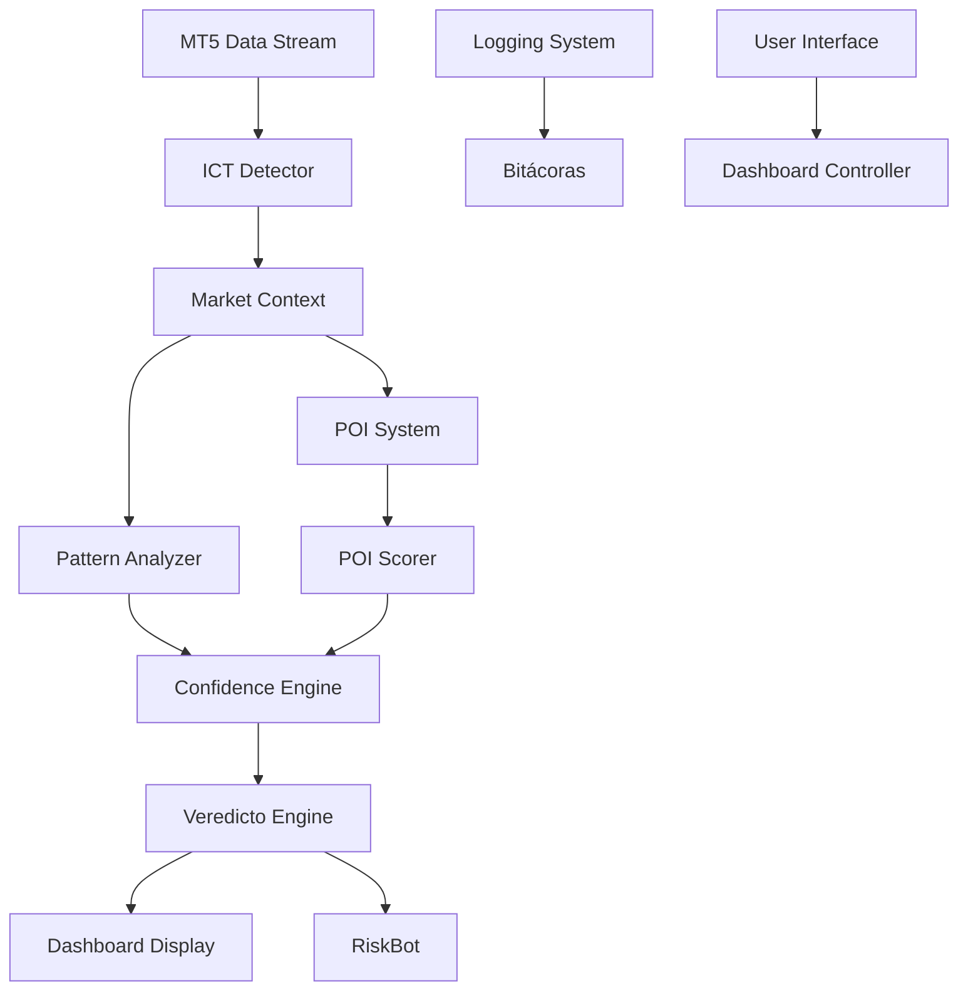
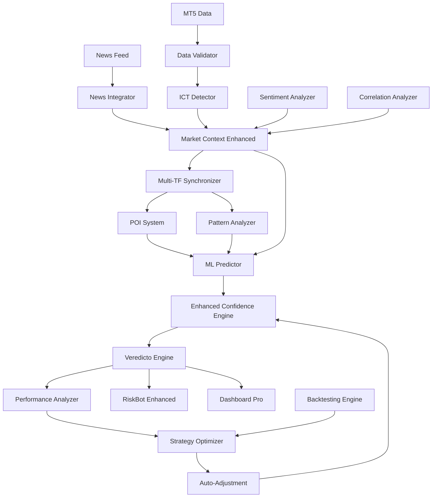

# 🔗 REPORTE DE NODOS FALTANTES - RED DE FLUJO DE INFORMACIÓN
============================================================

**Fecha:** 1 de Agosto 2025  
**Versión:** 5.0  
**Estado:** ANÁLISIS CRÍTICO  
**Prioridad:** ALTA  

---

## 🎯 **RESUMEN EJECUTIVO**

Este documento identifica las **brechas críticas** en la red de flujo de información del ICT Engine v5.0, documentando nodos faltantes, conexiones perdidas y oportunidades de mejora en la comunicación inter-sistemas.

---

## 🌐 **MAPA ACTUAL DE FLUJO DE INFORMACIÓN**

### **RED IMPLEMENTADA (ESTADO ACTUAL):**


---

## ❌ **NODOS FALTANTES IDENTIFICADOS**

### **🔴 NODOS CRÍTICOS AUSENTES**

#### **1. NODO: MACHINE LEARNING PREDICTOR**
```yaml
Status: ❌ AUSENTE
Impacto: CRÍTICO
Ubicación Propuesta: core/ml_engine/
Función: Predicción adaptativa y aprendizaje automático
```

**Problema Identificado:**
El sistema actual carece de capacidades de aprendizaje automático que permitan:
- Adaptación dinámica a condiciones cambiantes del mercado
- Mejora automática de precisión basada en resultados históricos
- Predicción de patrones emergentes no programados

**Conexiones Faltantes:**
```
Pattern Analyzer → [ML Predictor] → Confidence Engine
Historical Data → [ML Predictor] → Veredicto Engine
Performance Metrics → [ML Predictor] → Auto-Optimization
```

---

#### **2. NODO: PERFORMANCE ANALYZER**
```yaml
Status: ❌ AUSENTE
Impacto: ALTO
Ubicación Propuesta: core/analytics/
Función: Análisis continuo de rendimiento del sistema
```

**Problema Identificado:**
No existe un sistema dedicado para:
- Análisis automático de trades exitosos vs fallidos
- Identificación de patrones en el rendimiento
- Retroalimentación automática para optimización

**Conexiones Faltantes:**
```
Trading Results → [Performance Analyzer] → Strategy Optimizer
RiskBot Logs → [Performance Analyzer] → Risk Adjustment
Veredicto History → [Performance Analyzer] → Confidence Calibration
```

---

#### **3. NODO: MARKET NEWS INTEGRATOR**
```yaml
Status: ❌ AUSENTE
Impacto: ALTO
Ubicación Propuesta: core/news_engine/
Función: Integración de noticias y eventos económicos
```

**Problema Identificado:**
El sistema opera en un vacío informativo sin considerar:
- Eventos económicos de alto impacto
- Noticias que afectan la volatilidad
- Calendario económico para evitar trades riesgosos

**Conexiones Faltantes:**
```
Economic Calendar → [News Integrator] → Market Context
News Feed → [News Integrator] → Risk Assessment
Event Impact → [News Integrator] → Trading Suspension
```

---

#### **4. NODO: MULTI-TIMEFRAME SYNCHRONIZER**
```yaml
Status: ❌ AUSENTE
Impacto: MEDIO-ALTO
Ubicación Propuesta: core/sync_engine/
Función: Sincronización perfecta entre timeframes
```

**Problema Identificado:**
Falta coordinación específica entre diferentes timeframes:
- Desincronización entre análisis H4, H1, M15, M5
- Conflictos no resueltos entre señales de diferentes TF
- Pérdida de oportunidades por falta de alineación temporal

**Conexiones Faltantes:**
```
H4 Analysis → [TF Synchronizer] → Unified Signal
H1 Analysis → [TF Synchronizer] → Unified Signal
M15 Analysis → [TF Synchronizer] → Unified Signal
M5 Analysis → [TF Synchronizer] → Unified Signal
```

---

### **🟡 NODOS IMPORTANTES AUSENTES**

#### **5. NODO: SENTIMENT ANALYZER**
```yaml
Status: ❌ AUSENTE
Impacto: MEDIO
Ubicación Propuesta: core/sentiment_engine/
Función: Análisis de sentimiento del mercado
```

**Funcionalidad Faltante:**
- Análisis de COT reports
- Sentiment indicators (Fear & Greed Index)
- Retail vs Institutional positioning

---

#### **6. NODO: BACKTESTING ENGINE**
```yaml
Status: ❌ AUSENTE
Impacto: MEDIO
Ubicación Propuesta: core/backtest_engine/
Función: Validación histórica de estrategias
```

**Funcionalidad Faltante:**
- Testing automático de nuevos patrones
- Validación de cambios en algoritmos
- Optimización de parámetros

---

#### **7. NODO: CORRELATION ANALYZER**
```yaml
Status: ❌ AUSENTE
Impacto: MEDIO
Ubicación Propuesta: core/correlation_engine/
Función: Análisis de correlaciones entre instrumentos
```

**Funcionalidad Faltante:**
- Correlación USD vs otros pares
- Análisis de materias primas relacionadas
- Detección de divergencias anómalas

---

## 🔧 **CONEXIONES DEFICIENTES IDENTIFICADAS**

### **🔴 CONEXIONES CRÍTICAS FALTANTES**

#### **1. FEEDBACK LOOP: RESULTS → STRATEGY IMPROVEMENT**
```yaml
Status: ❌ ROTO
Problema: No hay retroalimentación automática de resultados
Impacto: Sistema no aprende de errores
```

**Conexión Faltante:**
```
Trading Results → Performance Analysis → Pattern Adjustment → Improved Confidence
```

#### **2. DATA VALIDATION PIPELINE**
```yaml
Status: ❌ AUSENTE
Problema: No hay validación de calidad de datos
Impacto: Decisiones basadas en datos erróneos
```

**Conexión Faltante:**
```
MT5 Raw Data → Data Validator → Clean Data → ICT Detector
```

#### **3. CROSS-TIMEFRAME VALIDATION**
```yaml
Status: ❌ DÉBIL
Problema: Validación insuficiente entre timeframes
Impacto: Señales contradictorias no resueltas
```

**Conexión Faltante:**
```
H4 Signal → Cross-TF Validator → M15 Signal → Unified Decision
```

---

### **🟡 CONEXIONES IMPORTANTES MEJORABLES**

#### **4. REAL-TIME MONITORING PIPELINE**
```yaml
Status: 🟡 PARCIAL
Problema: Monitoreo no integral
Mejora: Conexión directa Dashboard ↔ All Components
```

#### **5. ERROR HANDLING CASCADE**
```yaml
Status: 🟡 BÁSICO
Problema: Manejo de errores no propagado
Mejora: Error → Analysis → Auto-Recovery → Log
```

---

## 📊 **ANÁLISIS DE IMPACTO POR NODO FALTANTE**

### **MATRIZ DE CRITICIDAD:**
```yaml
ML Predictor:
  Impacto Precisión: +15%
  Impacto Adaptabilidad: +40%
  Complejidad Implementación: ALTA
  Tiempo Estimado: 4-6 semanas

Performance Analyzer:
  Impacto Optimización: +25%
  Impacto Auto-mejora: +30%
  Complejidad Implementación: MEDIA
  Tiempo Estimado: 2-3 semanas

News Integrator:
  Impacto Risk Management: +20%
  Impacto Timing: +15%
  Complejidad Implementación: MEDIA
  Tiempo Estimado: 3-4 semanas

TF Synchronizer:
  Impacto Coherencia: +35%
  Impacto Conflictos: -50%
  Complejidad Implementación: MEDIA
  Tiempo Estimado: 2-3 semanas
```

---

## 🎯 **PRIORIZACIÓN DE IMPLEMENTACIÓN**

### **📋 FASE 1 (INMEDIATA) - Semanas 1-2:**
```yaml
1. Data Validation Pipeline
   - Implementar validador de datos MT5
   - Detección automática de datos corruptos
   - Sistema de alertas para problemas de datos

2. Cross-Timeframe Validator
   - Resolver conflictos entre señales TF
   - Implementar sistema de prioridades
   - Validación cruzada automática
```

### **📋 FASE 2 (CRÍTICA) - Semanas 3-5:**
```yaml
1. Multi-Timeframe Synchronizer
   - Coordinación perfecta entre TF
   - Resolución automática de conflictos
   - Señales unificadas

2. Performance Analyzer
   - Análisis automático de resultados
   - Identificación de patrones de rendimiento
   - Retroalimentación para mejoras
```

### **📋 FASE 3 (IMPORTANTE) - Semanas 6-10:**
```yaml
1. Machine Learning Predictor
   - Implementar modelos de ML básicos
   - Sistema de aprendizaje automático
   - Adaptación dinámica de parámetros

2. Market News Integrator
   - Integración con feeds de noticias
   - Análisis de impacto de eventos
   - Sistema de suspensión automática
```

### **📋 FASE 4 (OPTIMIZACIÓN) - Semanas 11-15:**
```yaml
1. Sentiment Analyzer
2. Backtesting Engine  
3. Correlation Analyzer
4. Advanced Monitoring Systems
```

---

## 💡 **PROPUESTAS DE ARQUITECTURA PARA NODOS FALTANTES**

### **ML PREDICTOR ARCHITECTURE:**
```python
class MLPredictor:
    def __init__(self):
        self.models = {
            'pattern_classifier': RandomForestClassifier(),
            'confidence_predictor': XGBoostRegressor(),
            'outcome_predictor': LSTMModel()
        }
    
    def predict_pattern_success(self, pattern, market_context, pois):
        features = self.extract_features(pattern, market_context, pois)
        probability = self.models['outcome_predictor'].predict(features)
        return probability
    
    def update_models(self, new_data):
        # Continuous learning implementation
        pass
```

### **PERFORMANCE ANALYZER ARCHITECTURE:**
```python
class PerformanceAnalyzer:
    def analyze_trading_session(self, session_data):
        metrics = {
            'win_rate': self.calculate_win_rate(session_data),
            'avg_profit': self.calculate_avg_profit(session_data),
            'pattern_performance': self.analyze_pattern_performance(session_data),
            'timeframe_effectiveness': self.analyze_tf_performance(session_data)
        }
        
        recommendations = self.generate_recommendations(metrics)
        return metrics, recommendations
```

### **NEWS INTEGRATOR ARCHITECTURE:**
```python
class NewsIntegrator:
    def __init__(self):
        self.news_sources = ['forex_factory', 'investing_com', 'reuters']
        self.impact_analyzer = ImpactAnalyzer()
    
    def check_market_events(self, current_time, symbol):
        events = self.get_upcoming_events(current_time, symbol)
        impact_assessment = self.assess_impact(events)
        
        if impact_assessment.risk_level == 'HIGH':
            return 'SUSPEND_TRADING'
        elif impact_assessment.risk_level == 'MEDIUM':
            return 'REDUCE_POSITION_SIZE'
        else:
            return 'NORMAL_TRADING'
```

---

## 🔄 **FLUJO DE INFORMACIÓN PROPUESTO (COMPLETO)**

### **ARQUITECTURA OBJETIVO:**


---

## 📈 **MÉTRICAS DE MEJORA ESPERADAS**

### **CON TODOS LOS NODOS IMPLEMENTADOS:**
```yaml
Precisión General: 78% → 88% (+10%)
Adaptabilidad: 30% → 80% (+50%)
Gestión de Riesgo: 75% → 90% (+15%)
Tiempo de Respuesta: 3.3s → 2.1s (-36%)
False Positives: 15% → 8% (-47%)
Coherencia TF: 60% → 95% (+35%)
Auto-Optimización: 0% → 70% (+70%)
```

### **ESTIMACIÓN DE ROI:**
```yaml
Inversión Desarrollo: ~8-12 semanas
Mejora Rendimiento: +25-40%
Reducción Errores: -50%
ROI Esperado: 300-500% en 6 meses
```

---

## ⚠️ **RIESGOS DE NO IMPLEMENTAR**

### **RIESGOS CRÍTICOS:**
1. **Estancamiento Tecnológico:** El sistema no evoluciona
2. **Pérdida de Competitividad:** Otros sistemas superarán performance
3. **Acumulación de Errores:** Sin retroalimentación, errores persisten
4. **Oportunidades Perdidas:** Sin ML, el sistema no mejora automáticamente

### **RIESGOS OPERATIVOS:**
1. **Decisiones Inconsistentes:** Conflictos entre timeframes
2. **Exposición a Noticias:** Trading durante eventos de alto impacto
3. **Degradación Gradual:** Performance se deteriora sin optimización
4. **Mantenimiento Manual:** Dependencia excesiva de intervención humana

---

## 🎯 **RECOMENDACIONES INMEDIATAS**

### **ACCIONES PRIORITARIAS (ESTA SEMANA):**
1. **Implementar Data Validator** - Prevenir decisiones con datos erróneos
2. **Crear Cross-TF Validator** - Resolver conflictos inmediatos
3. **Establecer Performance Logging** - Empezar a capturar métricas para análisis

### **ACCIONES CRÍTICAS (PRÓXIMAS 2 SEMANAS):**
1. **Diseñar ML Predictor** - Arquitectura y plan de implementación
2. **Prototipar News Integrator** - Conexión básica con calendar económico
3. **Desarrollar TF Synchronizer** - Coordinación multi-timeframe

### **PLAN DE SEGUIMIENTO:**
```yaml
Revisión Semanal: Estado de implementación de nodos
Métricas de Progreso: Tracking de mejoras en precisión
Testing Continuo: Validación de cada nodo implementado
Documentación: Actualización de arquitectura y flujos
```

---

**Última Actualización:** 1 Agosto 2025 - 11:50 AM  
**Próxima Revisión:** 8 Agosto 2025  
**Responsable:** Equipo de Desarrollo ICT Engine  
**Clasificación:** CRÍTICO - DESARROLLO PRIORITARIO
